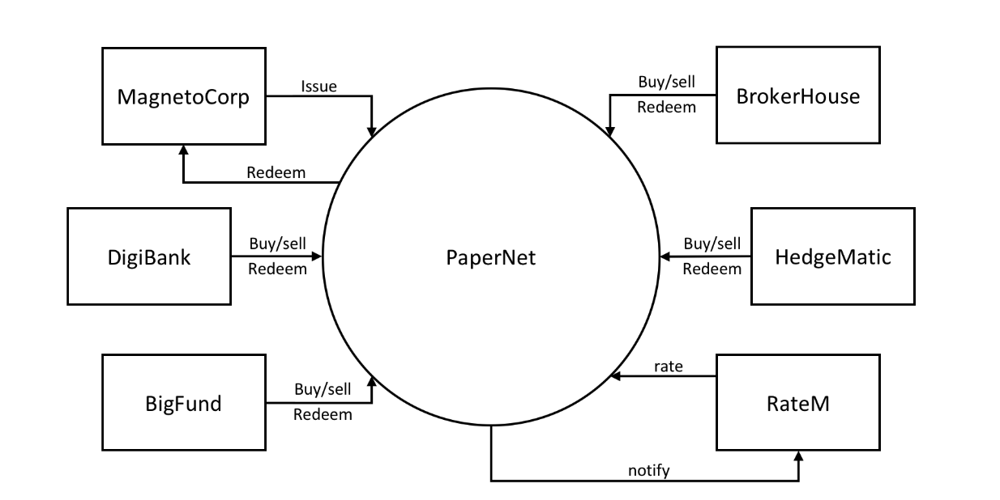
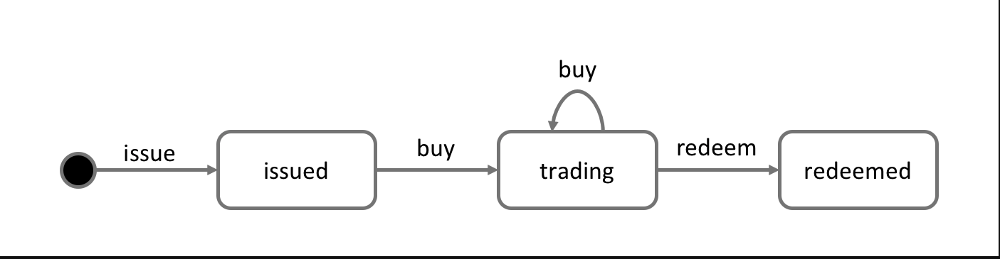
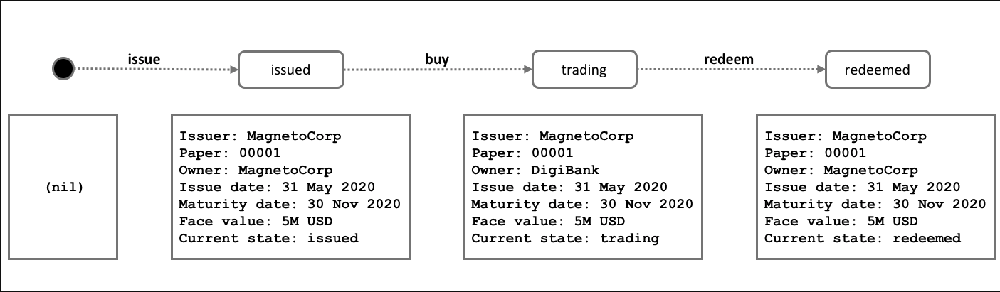
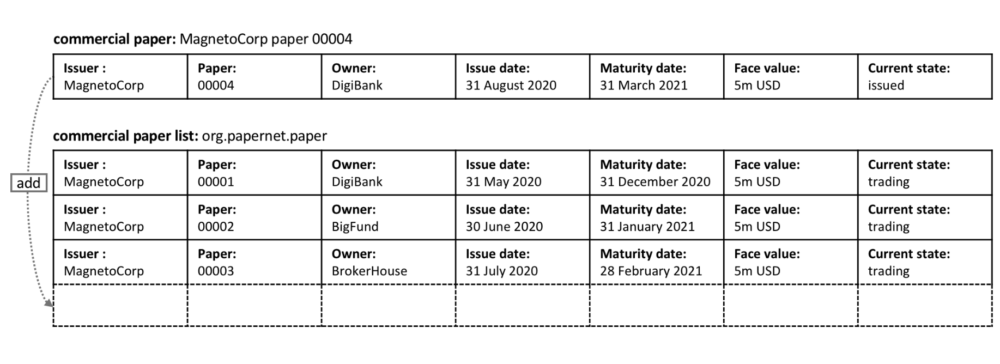
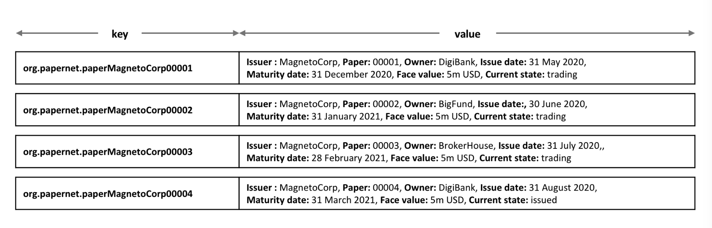
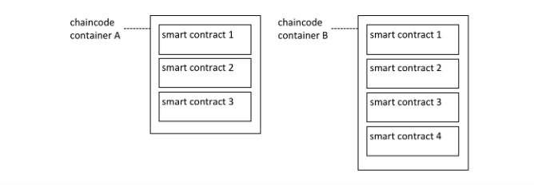
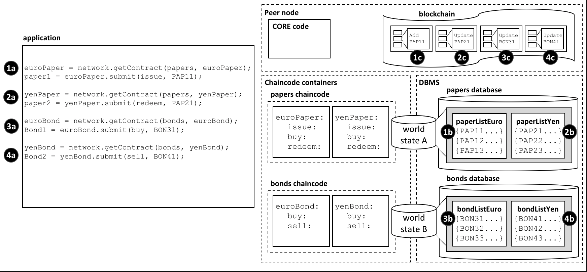

# HyperLedger Fabric 开发记录01

##### [参考文档（Hyperledger Fabric官方文档）](https://hyperledger-fabric.readthedocs.io/en/latest/developapps/scenario.html)
##### 本文主要为官方文档的阅读整理，加上部分自己的理解，以作为部门培训讲义及自己日后查阅

## 开发案例：票据网络(PaperNet)



* MagnetoCorp `发布Issue`和`赎回Redeem`债券
* 图中其他各公司 `购买Buy`、`卖出Sell`、`赎回Redeem`债券

## 票据生命周期状态变化演示(paper's lifecycle)
### 1 票据发布 (issue)
```
    Issuer = MagnetoCorp
    Paper = 00001
    Owner = MagnetoCorp
    Issue date = 31 May 2020
    Maturity = 30 November 2020
    Face value = 5M USD
    Current state = issued
```
* 赎回时将要支付5百万美元的面额(Face value = 5M USD)
* 发布者`Issuer = MagnetoCorp`和拥有者`Owner = MagnetoCorp`是同一个人
* 票据唯一的ID `MagnetoCorp00001`, 由 `Issuer` 和 `Paper`组成
* 票据当前的生命周期处于其`Current state = issued`的状态

### 2 DigiBank购买票据 (buy)
```
    Issuer = MagnetoCorp
    Paper = 00001
    Owner = DigiBank
    Issue date = 31 May 2020
    Maturity date = 30 November 2020
    Face value = 5M USD
    Current state = trading
```
* 购买票据后，合约状态的拥有这发生转变
* 当前的状态为 `trading`
* 该票据可以继续卖给其他组织

### 3 MagnetoCorp赎回票据 (redeem)
```
    Issuer = MagnetoCorp
    Paper = 00001
    Owner = MagnetoCorp
    Issue date = 31 May 2020
    Maturity date = 30 November 2020
    Face value = 5M USD
    Current state = redeemed
```
* 票据的最终状态为`redeemed`，代表票据生命周期结束
* 票据的发布者最终赎回票据 `Owner = MagnetoCorp`
* API `getCreator()` 获取创建者. 通过获取合约创建者的身份，可以对赎回对象进行访问控制

## 交易状态流转
### issue
```
    Txn = issue
    Issuer = MagnetoCorp
    Paper = 00001
    Issue time = 31 May 2020 09:00:00 EST
    Maturity date = 30 November 2020
    Face value = 5M USD
```

### purchase by DigiBank
```
    Txn = buy
    Issuer = MagnetoCorp
    Paper = 00001
    Current owner = MagnetoCorp
    New owner = DigiBank
    Purchase time = 31 May 2020 10:00:00 EST
    Price = 4.94M USD
```
* paper 是财产本身，transaction 是对财产的交易\操作,所以transaction会记录交易价格和操作时间。所有的交易记录，会影响paper和其最终状态
* 交易双方都需要对交易进行签名
* paper 实例相当为世界状态，存储 票据的最新状态

### purchase by BigFund
```
    Txn = buy
    Issuer = MagnetoCorp
    Paper = 00001
    Current owner = DigiBank
    New owner = BigFund
    Purchase time = 2 June 2020 12:20:00 EST
    Price = 4.93M USD
```

### purchase by HedgeMatic
```
    Txn = buy
    Issuer = MagnetoCorp
    Paper = 00001
    Current owner = BigFund
    New owner = HedgeMatic
    Purchase time = 3 June 2020 15:59:00 EST
    Price = 4.90M USD
```

### redeem 票据状态最终流转到 MagnetoCorp
```
    Txn = redeem
    Issuer = MagnetoCorp
    Paper = 00001
    Current owner = HedgeMatic
    Redeem time = 30 Nov 2020 12:00:00 EST
```

### Lifecycle 生命周期


* transaction 管理着 票据生命周期的过渡
* 智能合约 实现着票据在不同状态间的transaction逻辑
* 票据状态实际上保存在世界状态中

### 账本状态

* 各个属性的值构成了账本的世界状态



* 票据的状态流转





* 票据的物理存储
* 票据name + Issuer + Paper 构成类账本的键

### 背书策略：

* 背书策略定义了使背书交易生效所需的最小组织集合。要进行背书，组织的背书节点需要运行与交易相关的智能合约并签署其结果。当排序服务将交易发送给提交节点时，他们将分别检查交易中的背书是否满足背书策略。如果不是这种情况，则该交易将无效，并且不会对世界状态产生任何影响。

* 背书策略以两种不同的粒度起作用：可以为整个命名空间以及各个状态键设置策略。它们使用AND和OR这些的基本逻辑表达式来表示。例如，在PaperNet中，此方法可以按以下方式使用：MagnetoCorp卖给DigiBank的票据的背书策略可以设置为`AND（MagnetoCorp.peer，DigiBank.peer）`，要求对票据进行任何更改都要由MagnetoCorp和DigiBank共同背书。

## 合约Ledger API
### Ledger数据操作
* 创建Ledger存储的key `CompositeKey ledgerKey = this.ctx.getStub().createCompositeKey(this.name, state.getSplitKey());`
* 根据Key获取Ledger数据 `this.ctx.getStub().getState(ledgerKey.toString());`
* 设置更新Ledger数据 `this.ctx.getStub().putState(ledgerKey.toString(), data);`

## 智能合约的调用
### 客户端调用合约的流程

* 客户端提交一个交易，必须遵循以下6个步骤
	* 从钱包中选择一个身份
	* 连接到网关
	* 访问目标网络
	* 给智能合约构造交易请求对象
	* 将交易提交到网络
	* 处理响应

### 客户端怎么使用钱包和身份证明

* 钱包持有身份证明的集合，可以用他们访问各个网络
* 智能合约可以检索到这个身份证明在transaction context

```
// A wallet stores a collection of identities
Path walletPath = Paths.get("..",  "identity", "user", "isabella", "wallet");
Wallet wallet = Wallet.createFileSystemWallet(walletPath);

String userName = "User1@org1.example.com";

Path connectionProfile = Paths.get("..",  "gateway", "networkConnection.yaml");

// Set connection options on the gateway builder
builder.identity(wallet, userName).networkConfig(connectionProfile).discovery(false);
``` 

### 客户端如何通过gateway去连接网络

```
// Set connection options on the gateway builder
builder.identity(wallet, userName).networkConfig(connectionProfile).discovery(false);

// Connect to gateway using application specified parameters
try(Gateway gateway = builder.connect()) {
...
```
* connectionProfile : 提供识别网络节点的本地配置文件（./application/gateway/papernetConnection.yaml，包含peers，channels，orderers，organization，CAs）
* connectionOptions : 用来控制怎么和网络交互的选项集合（JAVA通过Gateway.Builder来设置connectionOptions --> identity、wallet 这两个用来去连接网络。commitTimeout设定SDK等待多少秒去了解是否一个交易已经被提交。strategy: EventStrategies.MSPID_SCOPE_ANYFORTX 设定只要有一个节点确认交易，SDK将通知应用程序。strategy: EventStrategies.NETWORK_SCOPE_ALLFORTX 设定所有的节点确认了交易，SDK将通知应用程序。）

### 如何访问一个特定网络

* 因为peer可以加入过个不同通络的channel。这些都将配置在connectionProfile.yaml中，gateway给客户端提供了访问多个网络channel的功能

```
// Connect to gateway using application specified parameters
try(Gateway gateway = builder.connect()) {
	// Access PaperNet network
	System.out.println("Use network channel: mychannel.");
	// gateway.getNetwork("mychannel"); 选择特定的channnel
	Network network = gateway.getNetwork("mychannel");
...
```


### 如何构造一个交易
```
// Get addressability to commercial paper contract
System.out.println("Use org.papernet.commercialpaper smart contract.");
Contract contract = network.getContract(contractName, "org.papernet.commercialpaper");
```

* 通过指定 name、智能合约的全名 来获取指定的合约
* `https://hyperledger-fabric.readthedocs.io/en/release-1.4/chaincode4noah.html` 介绍了如何安装、实例化一个包含多个智能合约的链码

```
const euroContract = await network.getContract('EuroCommercialPaperContract');

const bondContract = await network2.getContract('BondContract');
```
* 这里没有使用标准的合约名称，因为每个文件中只有一个智能合约，getContract()只使用他发现的第一个合约

### 如何提交一个交易
```
Txn = issue
Issuer = MagnetoCorp
Paper = 00001
Issue time = 31 May 2020 09:00:00 EST
Maturity date = 30 November 2020
Face value = 5M USD

// Issue commercial paper
System.out.println("Submit commercial paper issue transaction.");
byte[] response = contract.submitTransaction("issue", "MagnetoCorp", "00001", "2020-05-31", "2020-11-30", "5000000");

```
* 通过`contract.submitTransaction ` 对应票据合约的参数，提交交易
* 当调用 `contract.submitTransaction ` 提交交易后，控制权并没有直接到智能合约那里。而是SDK根据 connectionOptions 和 connectionProfile的内容去向合适的节点发送交易提案，然后得到提案的背书。但SDK的调用方并不会直接感受到这些细节。一切有SDK自己完成。
* `contract.submitTransaction`包含监听交易提交的内容。监听交易提交是要知道 交易是否被成功的排序，验证和提交到账本中。

### 如何处理交易响应
* 合约返回一个byte[]，业务根据自身需求进行反序列化

## 合约名 Contract names
* 链码（chaincode）是一个部署到Hyperledger Fabric区块链网络的基本容器。一个或多个智能合约（smart contract）被定义在一个链码中。每个智能合约有一个在链码中唯一可识别的名字。客户端通过在被实例化(instantiated)的链码中用合约名(contract name)访问指定的智能合约(smart contract)。

### 一个链码中包含多个智能合约


* 一个链码容器(chaincode container)中可能定义着多个智能合约。每个智能合约通过他们在链码中的唯一定义的名字被识别。
* 当一个链码容器被安装和实例化之后，在它内部的所有智能合约都对相应的渠道(channel)生效。
* 账本的数据结构由一组已部署的智能合约决定，因为只能合约中包含了它们关心的业务对象
* 在大部分的链码中只包含一个智能合约定义，但是将紧密相关的智能合约包含在一个链码中是有意义的。
 
### 如果指定一个智能合约名
```
@Contract(name = "org.papernet.commercialpaper"
        , info = @Info(title = "MyAsset contract", description = "", version = "0.0.1"
              , license = @License(name = "SPDX-License-Identifier: ", url = "")
              , contact = @Contact(email = "java-contract@example.com", name = "java-contract", url = "http://java-contract.me")
           )
        )
```

* 通过name显式地指定合约名`org.papernet.commercialpaper`，如果没有明确的指定合约名称，则会默认的使用类名作为合约名称。推荐使用 DNS风格（DNS-style）的命名方式，组织清洗，且富有意义。
* 如果在一个链码中，合约名重复，则会返回一个error

### 如何从客户端中去使用一个智能合约

* 一旦chaincode被`安装到peer`，并在`channel上实例化`，则该智能合约可被客户端访问。

```
// Access PaperNet network
System.out.println("Use network channel: mychannel.");
Network network = gateway.getNetwork("mychannel");

// Get addressability to commercial paper contract
System.out.println("Use org.papernet.commercialpaper smart contract.");
Contract contract = network.getContract(contractName, "org.papernet.commercialpaper");

// Issue commercial paper
System.out.println("Submit commercial paper issue transaction.");
byte[] response = contract.submitTransaction("issue", "MagnetoCorp", "00001", "2020-05-31", "2020-11-30", "5000000");

```

* 通过`network.getContract()`获取合约
* 通过`contract.submitTransaction`提交合约请求

### 默认的智能合约
* 默认的智能合约是定义在链码中的第一个合约，访问默认智能合约可以不指定合约名而直接访问它

```
// get the network and contract
Network network = gateway.getNetwork("mychannel");
Contract contract = network.getContract("fabcar");

byte[] result;
// contract.evaluateTransaction 用于查询
result = contract.evaluateTransaction("queryAllCars");
System.out.println(new String(result));

contract.submitTransaction("createCar", "CAR10", "VW", "Polo", "Grey", "Mary");
```

## 链码命名空间（chaincode namespace）



* 链码命名空间的理解类比为C#的命名空间，Java的包名。在Fabric中主要用于对channel中链码业务数据的隔离。大概隔离规则为按channel 按链码名区分，`channel + chaincode name`
* 每个channel有一个自己的blockchain
* 同一个channel上实例化的每个链码(chaincode)都有一个自己的世界状态(world state)存储，每个链码内存储的数据key在链码范围内需要唯一
* 同一个channel上的不同chaincode不能直接访问对方的世界状态(world state)，只能通过对方链码合约调用的方式`更新`，`查询`世界状态
* 不同channel上的chaincode只能查询其他channel上的世界状态，但不能更新

## 交易上下文(Transaction context)
* 交易上下文在智能合约被实例化之后创建，并提供给后续的交易使用

### 交易上下文的意义

* 在票据网络的案例中，papercontract 中定义了它所表示的商业票据的名称列表。issue交易操作会向列表中添加新的票据，buy交易操作会更新列表中票据的拥有者，redeem交易操作会使票据被标记为已完成。
* 智能合约交易上下文，使得智能合约可以通过以上的交易调用来`定义`和`维护`用户数据

### 交易上下文开发

* code自己的上下文(fabric-samples/commercial-paper/organization/digibank/contract-java)

```
class CommercialPaperContext extends Context {

    public CommercialPaperContext(ChaincodeStub stub) {
        super(stub);
        this.paperList = new PaperList(this);
    }

    public PaperList paperList;

}
```
* 实例化上下文

```
@Override
public Context createContext(ChaincodeStub stub) {
   return new CommercialPaperContext(stub);
}
```

### [交易上下文的stub，clientIdentity(参考图例)](https://hyperledger-fabric.readthedocs.io/en/latest/developapps/transactioncontext.html#structure)
* `ctx.sub` 被用来调用交易执行操作的api。如`putState()`，`getState()`来访问ledger。`getTxID()`来检索当前交易的ID。
	* 世界状态数据APIs（World state data APIs）
		* [getState()](https://fabric-shim.github.io/master/fabric-shim.ChaincodeStub.html#getState__anchor) 检索给定key的当前值
		* [putState()](https://fabric-shim.github.io/master/fabric-shim.ChaincodeStub.html#putState__anchor) 存储写入的给定键值key,value
		* [deleteState()](https://fabric-shim.github.io/master/fabric-shim.ChaincodeStub.html#deleteState__anchor) 检索给定key删除存储的值
		* [getStateByRange()](https://fabric-shim.github.io/master/fabric-shim.ChaincodeStub.html#getStateByRange__anchor)根据startKey，endKey返回键值集合的迭代器
		* [getStateByRangeWithPagination()](https://fabric-shim.github.io/master/fabric-shim.ChaincodeStub.html#getStateByRangeWithPagination__anchor)
		* [getStateByPartialCompositeKey()](https://fabric-shim.github.io/master/fabric-shim.ChaincodeStub.html#getStateByPartialCompositeKey__anchor)
		* [getStateByPartialCompositeKeyWithPagination()](https://fabric-shim.github.io/master/fabric-shim.ChaincodeStub.html#getStateByPartialCompositeKeyWithPagination__anchor)
		* [getQueryResult()](https://fabric-shim.github.io/master/fabric-shim.ChaincodeStub.html#getQueryResult__anchor)
		* [getQueryResultWithPagination()](https://fabric-shim.github.io/master/fabric-shim.ChaincodeStub.html#getQueryResultWithPagination__anchor)
	* 私有数据APIs（Private data PAIs）和World state data APIs类似，但操作的是私有数据
		* [getPrivateData()](https://fabric-shim.github.io/master/fabric-shim.ChaincodeStub.html#getPrivateData__anchor)
		* [putPrivateData()](https://fabric-shim.github.io/master/fabric-shim.ChaincodeStub.html#putPrivateData__anchor)
		* [deletePrivateData()](https://fabric-shim.github.io/master/fabric-shim.ChaincodeStub.html#deletePrivateData__anchor)
		* [getPrivateData()](https://fabric-shim.github.io/master/fabric-shim.ChaincodeStub.html#getPrivateDataByRange__anchor)
		* [putPrivateData()](https://fabric-shim.github.io/master/fabric-shim.ChaincodeStub.html#getPrivateDataByPartialCompositeKey__anchor)
		* [deletePrivateData()](https://fabric-shim.github.io/master/fabric-shim.ChaincodeStub.html#getPrivateDataQueryResult__anchor)
	* 交易APIs （transaction APIs）这些API被用来检索当前交易提案执行的详情。包含交易ID和交易创建的时间
		* [getTxID()](https://fabric-shim.github.io/master/fabric-shim.ChaincodeStub.html#getTxID__anchor) 返回当前交易提案的ID
		* [getTxTimestamp()](https://fabric-shim.github.io/master/fabric-shim.ChaincodeStub.html#getTxTimestamp__anchor) 返回当前交易提案创建的时间戳
		* [getCreator()](https://fabric-shim.github.io/master/fabric-shim.ChaincodeStub.html#getCreator__anchor) 返回提案创建人的ID信息对象
		* [getSignedProposal()](https://fabric-shim.github.io/master/fabric-shim.ChaincodeStub.html#getSignedProposal__anchor) 返回被智能合约正在执行的提案的签名副本。
		* [getBinding()](https://fabric-shim.github.io/master/fabric-shim.ChaincodeStub.html#getBinding__anchor) 被用来使用nonce防止交易被故意或意外的重放攻击。（nonce被客户端生成，并包含在交易的加密hash中）
		* [getTransient()](https://fabric-shim.github.io/master/fabric-shim.ChaincodeStub.html#getTransient__anchor) 允许智能合约获取程序传递给起的瞬态数据(transient data)，瞬态数据是要被智能合约加密的私有数据，这些数据ledger不保存，一般在私有数据操作中使用
	* Key APIs（被智能合约用来操作世界状态的key或者是私有数据集合）
		* [createCompositeKey()](https://fabric-shim.github.io/master/fabric-shim.ChaincodeStub.html#createCompositeKey__anchor)
		* [splitCompositeKey()](https://fabric-shim.github.io/master/fabric-shim.ChaincodeStub.html#splitCompositeKey__anchor)
		* [setStateValidationParameter()](https://fabric-shim.github.io/master/fabric-shim.ChaincodeStub.html#setStateValidationParameter__anchor)
		* [getStateValidationParameter()](https://fabric-shim.github.io/master/fabric-shim.ChaincodeStub.html#getStateValidationParameter__anchor)
		* [getPrivateDataValidationParameter()](https://fabric-shim.github.io/master/fabric-shim.ChaincodeStub.html#getPrivateDataValidationParameter__anchor)
		* [setPrivateDataValidationParameter()](https://fabric-shim.github.io/master/fabric-shim.ChaincodeStub.html#setPrivateDataValidationParameter__anchor)
		* [getHistoryForKey()](https://fabric-shim.github.io/master/fabric-shim.ChaincodeStub.html#getHistoryForKey__anchor)
	* Event API
		* [setEvent()](https://fabric-shim.github.io/master/fabric-shim.ChaincodeStub.html#setEvent__anchor) 智能合约使用这个API向用户添加交易响应事件。这些事件最终会记录在区块链中，并发送给监听响应节点的客户端。
	* Utility APIs 包含获取当前channel名，传递控制权 到同一个peer上的不同chaincode。
		* [getChannelID()](https://fabric-shim.github.io/master/fabric-shim.ChaincodeStub.html#getChannelID__anchor) 通过此API来确定，客户端在哪个channel上调用了智能合约。
		* [invokeChaincode()](https://fabric-shim.github.io/master/fabric-shim.ChaincodeStub.html#invokeChaincode__anchor) 通过此API调用其他智能合约，不能调用其他peer上的智能合约。
	* [getFunctionAndParameters()](https://fabric-shim.github.io/master/fabric-shim.ChaincodeStub.html#getFunctionAndParameters__anchor)
	* [getStringArgs()](https://fabric-shim.github.io/master/fabric-shim.ChaincodeStub.html#getStringArgs__anchor)
	* [getArgs()](https://fabric-shim.github.io/master/fabric-shim.ChaincodeStub.html#getArgs__anchor)


